# SCProkaR TATA Workflow

## Overview

This vignette demonstrates Time Aware Trajectory Analysis (TATA), a
PAGA-inspired trajectory abstraction that uses real experimental time
labels to score and direct cluster-level transitions.

The workflow below:

- simulates a center-rooted multi-drug time course
- visualizes the stored PCA and UMAP representations
- builds the cell-level kNN graph and graph-based clusters
- computes topology and time-consistency scores between clusters
- constructs the abstract TATA graph
- runs the one-step
  [`run_tata()`](https://monash-li-lab.github.io/scProka/reference/run_tata.md)
  wrapper and overlays the inferred trajectories

The simulation is intentionally awkward for topology-only methods
because the earliest cells are near the middle of the embedding rather
than at a clear tip.

## Load packages

``` r
library(SingleCellExperiment)
#> Loading required package: SummarizedExperiment
#> Loading required package: MatrixGenerics
#> Loading required package: matrixStats
#> 
#> Attaching package: 'MatrixGenerics'
#> The following objects are masked from 'package:matrixStats':
#> 
#>     colAlls, colAnyNAs, colAnys, colAvgsPerRowSet, colCollapse,
#>     colCounts, colCummaxs, colCummins, colCumprods, colCumsums,
#>     colDiffs, colIQRDiffs, colIQRs, colLogSumExps, colMadDiffs,
#>     colMads, colMaxs, colMeans2, colMedians, colMins, colOrderStats,
#>     colProds, colQuantiles, colRanges, colRanks, colSdDiffs, colSds,
#>     colSums2, colTabulates, colVarDiffs, colVars, colWeightedMads,
#>     colWeightedMeans, colWeightedMedians, colWeightedSds,
#>     colWeightedVars, rowAlls, rowAnyNAs, rowAnys, rowAvgsPerColSet,
#>     rowCollapse, rowCounts, rowCummaxs, rowCummins, rowCumprods,
#>     rowCumsums, rowDiffs, rowIQRDiffs, rowIQRs, rowLogSumExps,
#>     rowMadDiffs, rowMads, rowMaxs, rowMeans2, rowMedians, rowMins,
#>     rowOrderStats, rowProds, rowQuantiles, rowRanges, rowRanks,
#>     rowSdDiffs, rowSds, rowSums2, rowTabulates, rowVarDiffs, rowVars,
#>     rowWeightedMads, rowWeightedMeans, rowWeightedMedians,
#>     rowWeightedSds, rowWeightedVars
#> Loading required package: GenomicRanges
#> Loading required package: stats4
#> Loading required package: BiocGenerics
#> Loading required package: generics
#> 
#> Attaching package: 'generics'
#> The following objects are masked from 'package:base':
#> 
#>     as.difftime, as.factor, as.ordered, intersect, is.element, setdiff,
#>     setequal, union
#> 
#> Attaching package: 'BiocGenerics'
#> The following objects are masked from 'package:stats':
#> 
#>     IQR, mad, sd, var, xtabs
#> The following objects are masked from 'package:base':
#> 
#>     anyDuplicated, aperm, append, as.data.frame, basename, cbind,
#>     colnames, dirname, do.call, duplicated, eval, evalq, Filter, Find,
#>     get, grep, grepl, is.unsorted, lapply, Map, mapply, match, mget,
#>     order, paste, pmax, pmax.int, pmin, pmin.int, Position, rank,
#>     rbind, Reduce, rownames, sapply, saveRDS, table, tapply, unique,
#>     unsplit, which.max, which.min
#> Loading required package: S4Vectors
#> 
#> Attaching package: 'S4Vectors'
#> The following object is masked from 'package:utils':
#> 
#>     findMatches
#> The following objects are masked from 'package:base':
#> 
#>     expand.grid, I, unname
#> Loading required package: IRanges
#> Loading required package: Seqinfo
#> Loading required package: Biobase
#> Welcome to Bioconductor
#> 
#>     Vignettes contain introductory material; view with
#>     'browseVignettes()'. To cite Bioconductor, see
#>     'citation("Biobase")', and for packages 'citation("pkgname")'.
#> 
#> Attaching package: 'Biobase'
#> The following object is masked from 'package:MatrixGenerics':
#> 
#>     rowMedians
#> The following objects are masked from 'package:matrixStats':
#> 
#>     anyMissing, rowMedians
library(SummarizedExperiment)
```

## Simulate a multi-drug trajectory

``` r
set.seed(101)

sce <- simulate_tata_multidrug_sce(
  n_cells = 2500,
  n_features = 100,
  n_pcs = 20,
  seed = 101
)

sce$timepoint_factor <- factor(
  sce$timepoint,
  levels = sort(unique(sce$timepoint))
)
```

Inspect the simulation design:

``` r
with(as.data.frame(SummarizedExperiment::colData(sce)), table(condition, timepoint))
#>          timepoint
#> condition   0  24  48  72  96 120
#>    drug_A 134 138 135 151 135 138
#>    drug_B 166 122 167 138 167 115
#>    drug_C 153 103 160 115 160 103
```

Visualize the stored embedding:

``` r
PlotReduction(sce, reduction = "UMAP", colour_by = "timepoint_factor")
```

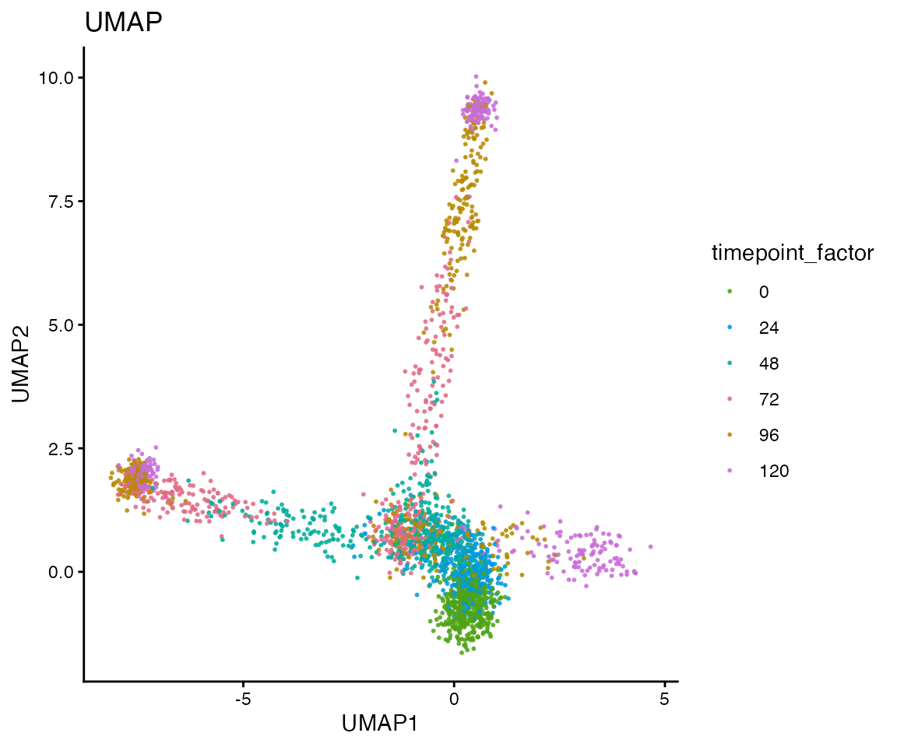

``` r
PlotReduction(sce, reduction = "UMAP", colour_by = "condition")
```

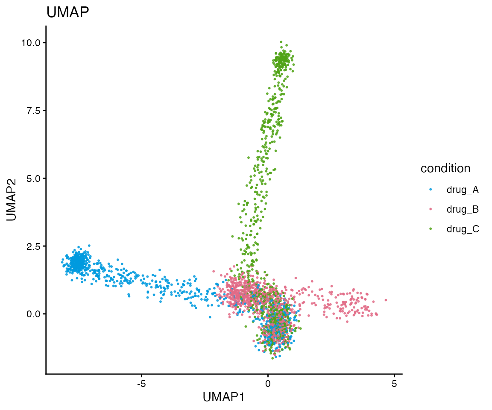

``` r
PlotReduction(sce, reduction = "UMAP", colour_by = "simulated_state")
```

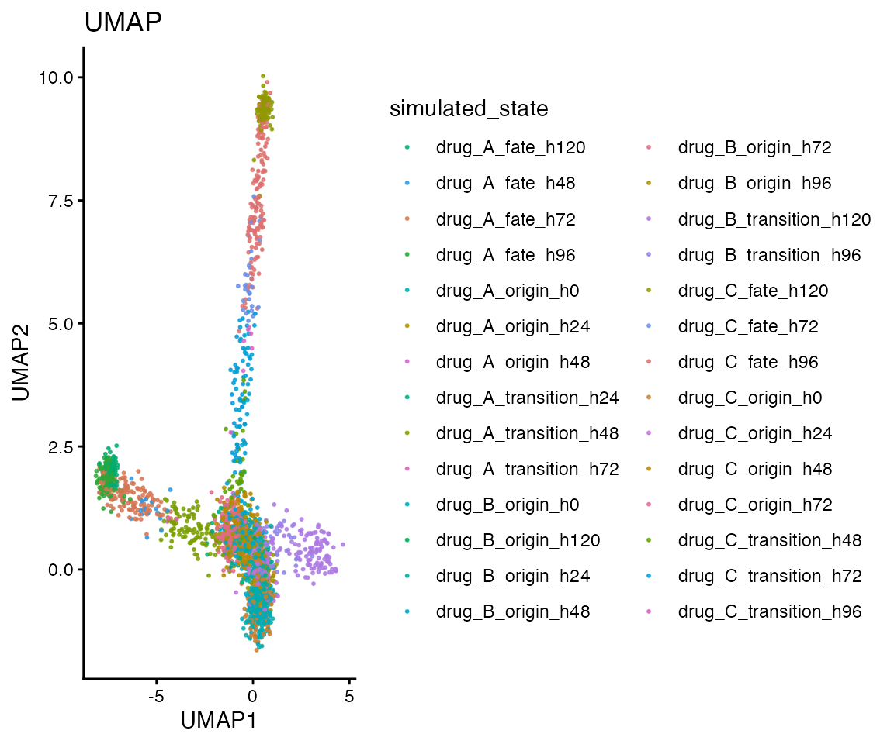

## Build the cell-cell graph

TATA starts from a low-dimensional representation. Here we use the
stored PCA coordinates and connect each cell to its nearest neighbours.

``` r
knn <- build_knn_graph(
  x = sce,
  dimred = "PCA",
  k = 30
)

c(
  n_cells = igraph::vcount(knn$graph),
  n_edges = igraph::ecount(knn$graph),
  k = knn$k
)
#> n_cells n_edges       k 
#>    2500   45687      30
```

## Cluster cells into coarse states

The cell graph is clustered into coarse states that serve as nodes in
the abstract TATA graph.

``` r
sce$tata_cluster_step <- factor(
  cluster_graph_states(
    cell_graph = knn$graph,
    method = "louvain",
    seed = 101
  )
)

table(sce$tata_cluster_step)
#> 
#>  C1  C2  C3  C4  C5  C6  C7  C8  C9 C10 C11 C12 C13 C14 C15 
#> 233 104 314 163 320 116 192 150 167 130 194 146 129  61  81
PlotReduction(sce, reduction = "UMAP", colour_by = "tata_cluster_step")
```

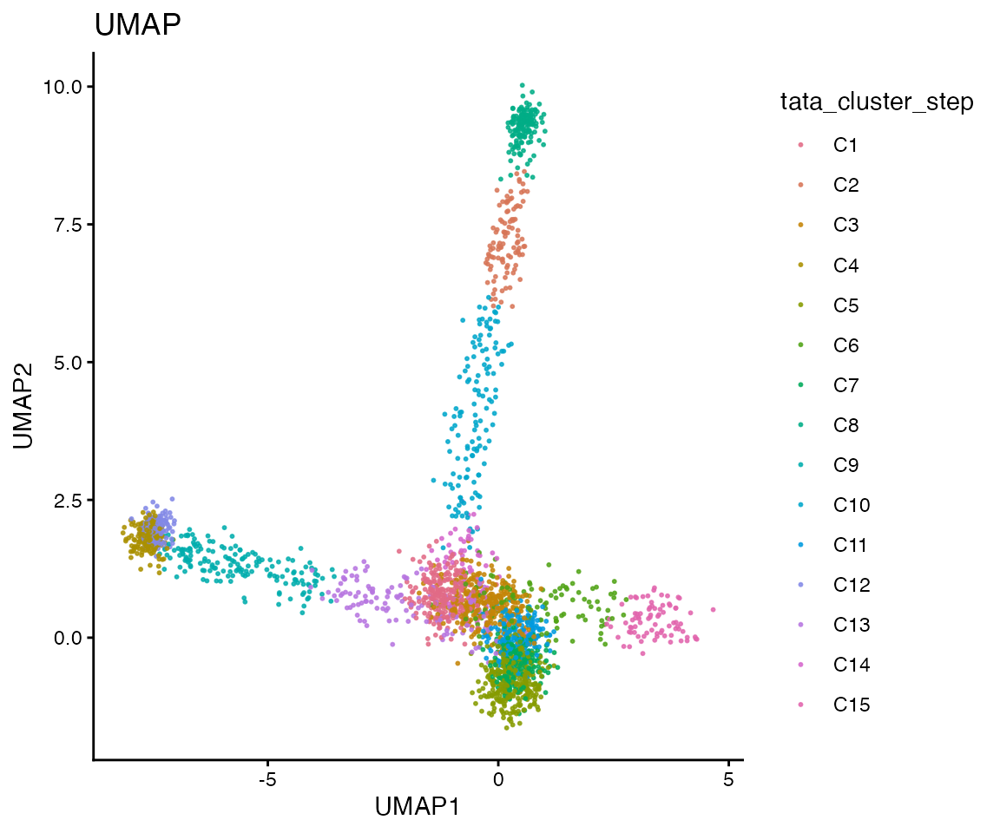

## Compute topology and time scores

TATA combines two ingredients for each cluster pair:

- a topology score based on how strongly the two clusters are connected
  in the cell-cell graph
- a time-consistency score based on whether those inter-cluster edges
  follow the observed experimental time order

``` r
topology_table <- compute_topology_weights(
  adjacency = knn$adjacency,
  clusters = sce$tata_cluster_step
)

time_table <- compute_time_weights(
  adjacency = knn$adjacency,
  clusters = sce$tata_cluster_step,
  timepoint = sce$timepoint
)

head(
  topology_table[
    order(-topology_table$topology_weight),
    c("cluster_a", "cluster_b", "observed_edges", "expected_edges", "topology_weight")
  ],
  8
)
#>    cluster_a cluster_b observed_edges expected_edges topology_weight
#> 94       C10       C14             99       101.7095       0.9733601
#> 73        C7       C11            555       577.9481       0.9602938
#> 69        C6       C15             98       115.5356       0.8482237
#> 52        C5        C7            611       933.1478       0.6547730
#> 22        C2       C10            106       174.5939       0.6071232
#> 38        C3       C14            152       267.1860       0.5688922
#> 20        C2        C8            105       217.1197       0.4836041
#> 35        C3       C11            400       984.3900       0.4063430

head(
  time_table[
    order(-time_table$time_consistency),
    c("cluster_a", "cluster_b", "n_time_edges", "flow_score", "time_weight", "time_consistency")
  ],
  8
)
#>     cluster_a cluster_b n_time_edges flow_score time_weight time_consistency
#> 98        C11       C14           13  1.0000000   1.0000000        1.0000000
#> 103       C13       C14           15  0.5333333   0.7666667        0.7666667
#> 13         C1       C14            6  0.5000000   0.7500000        0.7500000
#> 56         C5       C11            2  0.5000000   0.7500000        0.7500000
#> 97        C11       C13           91  0.3406593   0.6703297        0.6703297
#> 94        C10       C14           99 -0.3333333   0.3333333        0.6666667
#> 47         C4       C12          127  0.3307087   0.6653543        0.6653543
#> 35         C3       C11          400 -0.3125000   0.3437500        0.6562500
```

``` r
edge_metric_table <- merge(
  topology_table,
  time_table,
  by = c("cluster_a", "cluster_b"),
  all.x = TRUE,
  sort = FALSE
)

ggplot2::ggplot(
  edge_metric_table,
  ggplot2::aes(
    x = topology_weight,
    y = flow_score,
    size = observed_edges,
    colour = time_consistency
  )
) +
  ggplot2::geom_hline(yintercept = c(-0.10, 0.10), linetype = 2, colour = "grey60") +
  ggplot2::geom_point(alpha = 0.8) +
  ggplot2::scale_colour_viridis_c(option = "plasma") +
  ggplot2::theme_classic() +
  ggplot2::labs(
    title = "Topology and time consistency for cluster pairs",
    x = "topology weight",
    y = "temporal flow score",
    colour = "time consistency",
    size = "observed edges"
  )
```

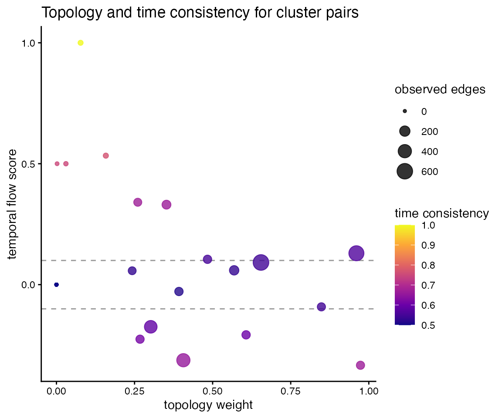

## Build the abstract TATA graph

``` r
tata_manual <- build_tata_graph(
  topology_table = topology_table,
  time_table = time_table,
  clusters = sce$tata_cluster_step,
  embedding = SingleCellExperiment::reducedDim(sce, "PCA"),
  timepoint = sce$timepoint,
  alpha = 1,
  beta = 1,
  direction_threshold = 0.10,
  prune_threshold = 0.001,
  time_weight_mode = "directional_confidence"
)

head(
  tata_manual$edge_table[
    order(-tata_manual$edge_table$tata_weight),
    c(
      "cluster_a",
      "cluster_b",
      "topology_weight",
      "flow_score",
      "time_weight",
      "time_consistency",
      "tata_weight",
      "direction_label",
      "kept"
    )
  ],
  10
)
#>    cluster_a cluster_b topology_weight  flow_score time_weight time_consistency
#> 94       C10       C14       0.9733601 -0.33333333   0.3333333        0.6666667
#> 73        C7       C11       0.9602938  0.12972973   0.5648649        0.5648649
#> 69        C6       C15       0.8482237 -0.09183673   0.4540816        0.5459184
#> 22        C2       C10       0.6071232 -0.20754717   0.3962264        0.6037736
#> 52        C5        C7       0.6547730  0.09165303   0.5458265        0.5458265
#> 38        C3       C14       0.5688922  0.05921053   0.5296053        0.5296053
#> 20        C2        C8       0.4836041  0.10476190   0.5523810        0.5523810
#> 35        C3       C11       0.4063430 -0.31250000   0.3437500        0.6562500
#> 47        C4       C12       0.3522126  0.33070866   0.6653543        0.6653543
#> 88        C9       C13       0.3921301 -0.02830189   0.4858491        0.5141509
#>    tata_weight direction_label kept
#> 94   0.6489067      C14 -> C10 TRUE
#> 73   0.5424362       C7 -> C11 TRUE
#> 69   0.4630609       C6 -- C15 TRUE
#> 22   0.3665649       C10 -> C2 TRUE
#> 52   0.3573925        C5 -- C7 TRUE
#> 38   0.3012883       C3 -- C14 TRUE
#> 20   0.2671337        C2 -> C8 TRUE
#> 35   0.2666626       C11 -> C3 TRUE
#> 47   0.2343462       C4 -> C12 TRUE
#> 88   0.2016140       C9 -- C13 TRUE
```

The cluster graph is easiest to interpret when it is overlaid onto the
same embedding used to view the cells:

``` r
plot_tata_cluster_graph(
  list(
    cluster_graph = tata_manual$graph,
    sce = sce,
    parameters = list(cluster_col = "tata_cluster_step")
  ),
  dimred = "UMAP",
  layout_mode = "embedding",
  show_cells = TRUE,
  colour_by = "tata_cluster_step",
  node_colour_by = "cluster",
  main = "Manual TATA graph aligned to UMAP"
)
```

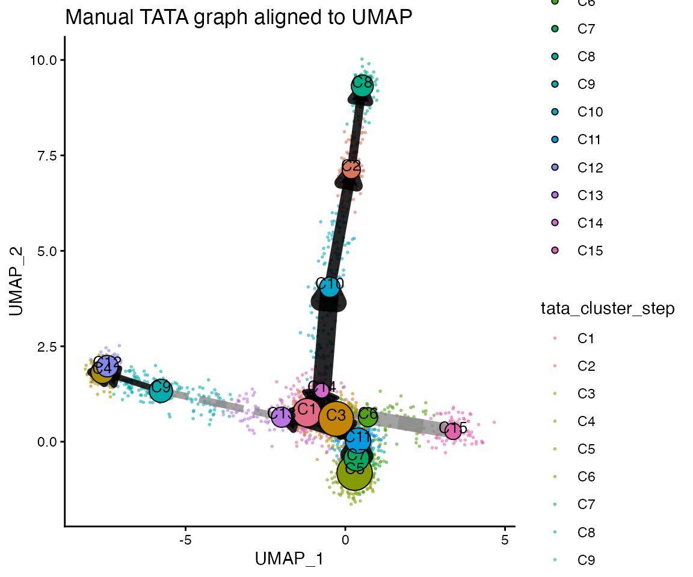

## Run the full wrapper

For most analyses it is simpler to call
[`run_tata()`](https://monash-li-lab.github.io/scProka/reference/run_tata.md)
directly and let the package carry out graph construction, clustering,
edge scoring, and pseudotime.

``` r
tata <- run_tata(
  sce = sce,
  dimred = "PCA",
  time_col = "timepoint",
  cluster_col = "tata_cluster",
  k = 30,
  cluster_method = "louvain",
  alpha = 1,
  beta = 1,
  direction_threshold = 0.10,
  prune_threshold = 0.001,
  time_weight_mode = "directional_confidence",
  do_pseudotime = TRUE,
  seed = 101
)

sce_tata <- tata$sce
sce_tata$tata_cluster <- factor(sce_tata$tata_cluster)
```

Inspect the wrapper output on the embedding:

``` r
PlotReduction(sce_tata, reduction = "UMAP", colour_by = "tata_cluster")
```

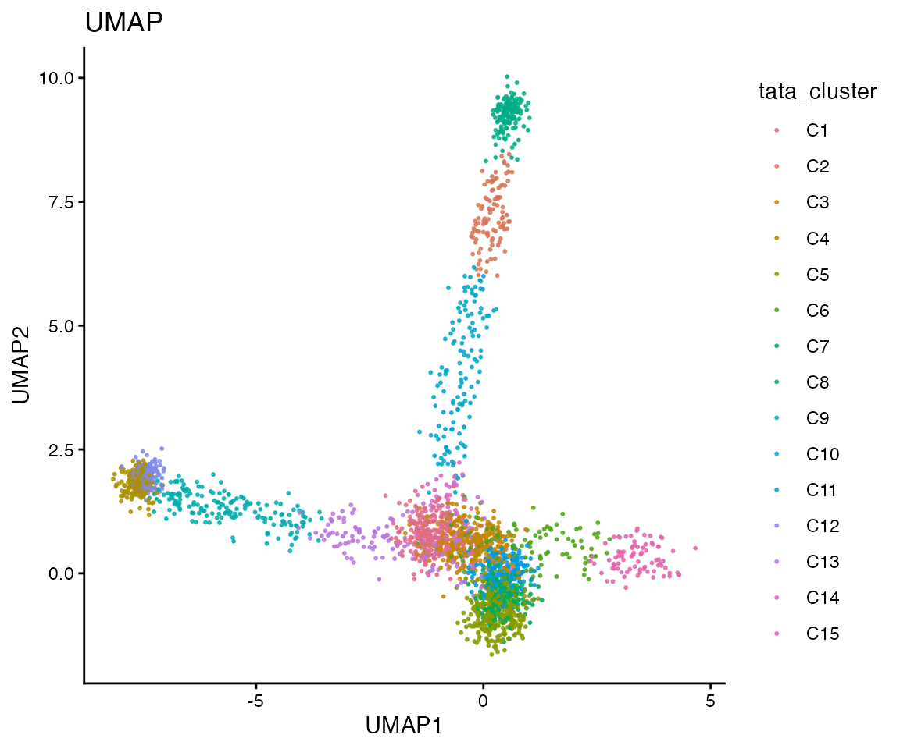

``` r
PlotReduction(sce_tata, reduction = "UMAP", colour_by = "tata_pseudotime_scaled")
```

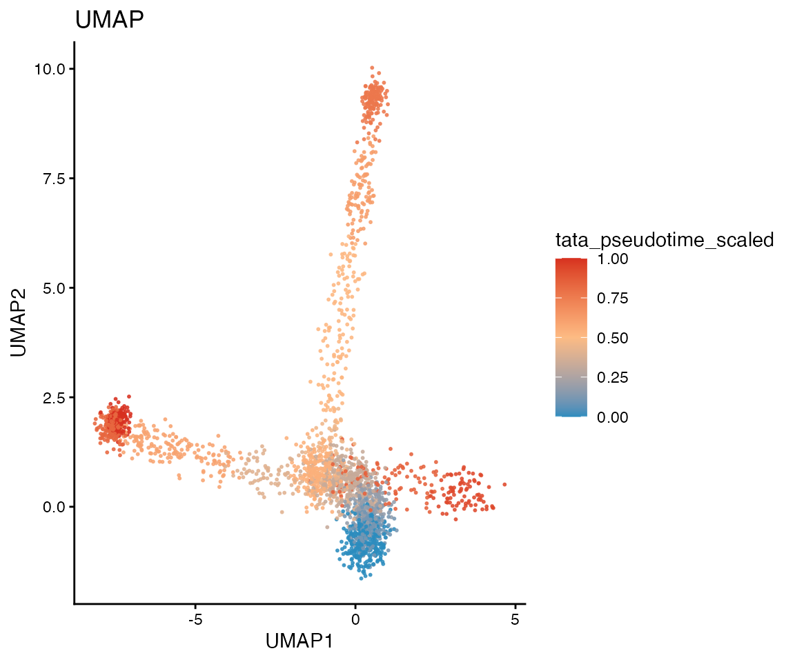

``` r
plot_tata_cluster_graph(
  tata,
  dimred = "UMAP",
  layout_mode = "embedding",
  show_cells = TRUE,
  colour_by = "timepoint",
  node_colour_by = "cluster",
  main = "TATA abstract graph aligned to UMAP"
)
```

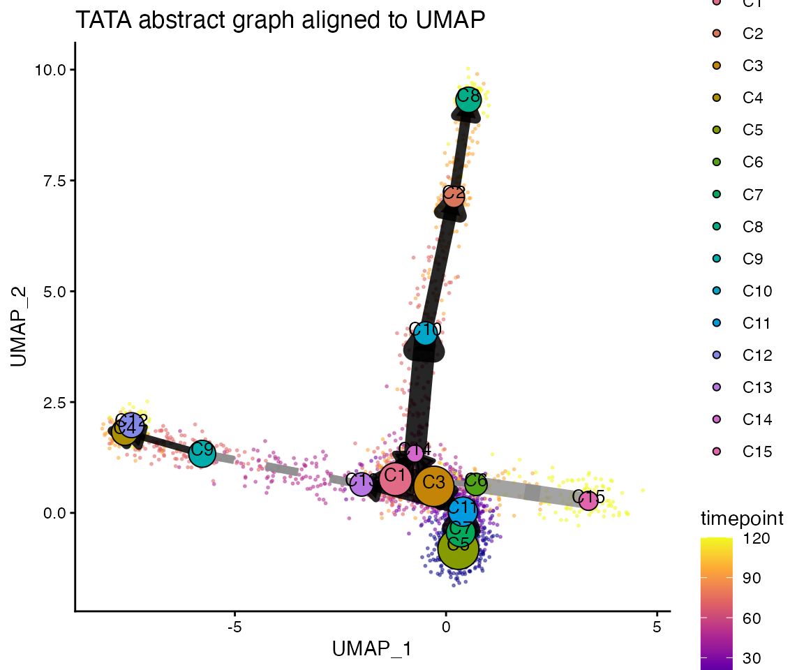

[`plot_tata_trajectory_embedding()`](https://monash-li-lab.github.io/scProka/reference/plot_tata_trajectory_embedding.md)
provides a more classic trajectory overlay. Use `mode = "full"` to draw
all inferred paths or `mode = "combined"` to show one long summary arrow
per major branch.

``` r
plot_tata_trajectory_embedding(
  tata,
  dimred = "UMAP",
  colour_by = "timepoint",
  mode = "full",
  smooth_paths = TRUE
)
```

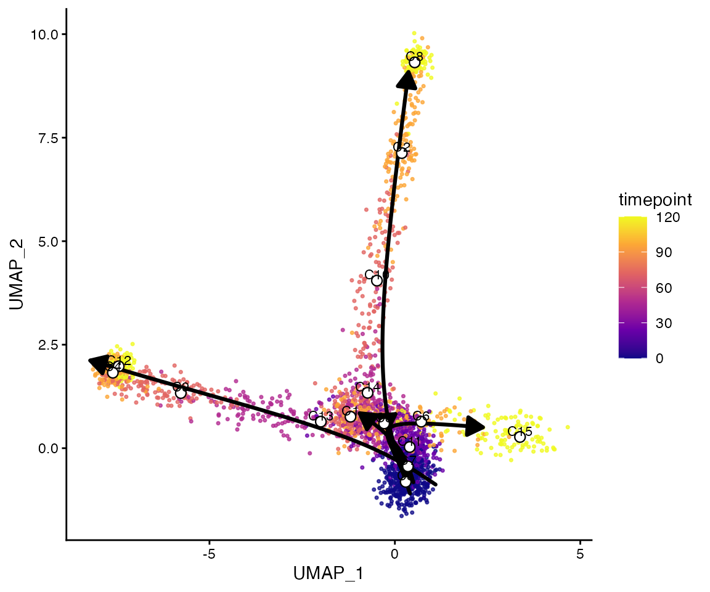

``` r
plot_tata_trajectory_embedding(
  tata,
  dimred = "UMAP",
  colour_by = "timepoint",
  mode = "combined",
  max_paths = 3,
  smooth_paths = TRUE
)
```

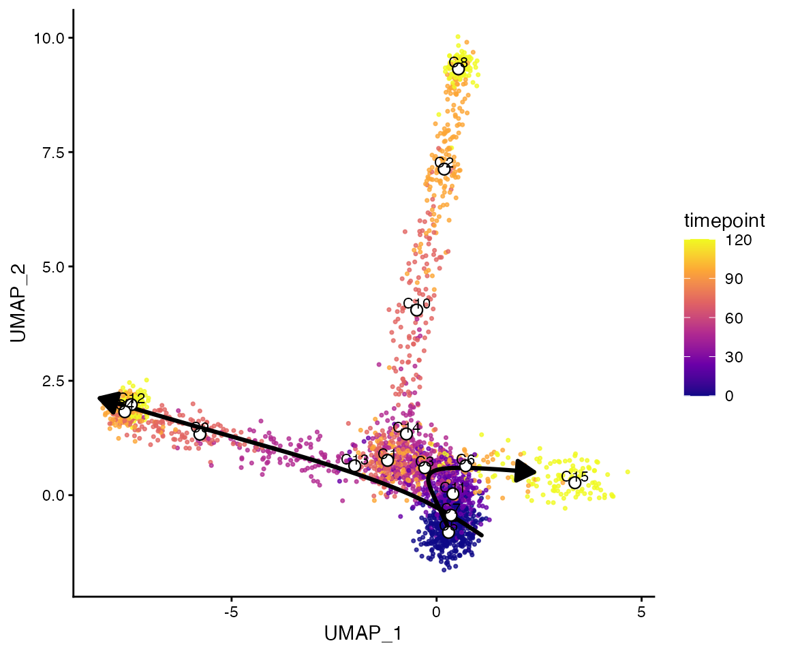

## Notes

- [`build_knn_graph()`](https://monash-li-lab.github.io/scProka/reference/build_knn_graph.md),
  [`compute_topology_weights()`](https://monash-li-lab.github.io/scProka/reference/compute_topology_weights.md),
  and
  [`compute_time_weights()`](https://monash-li-lab.github.io/scProka/reference/compute_time_weights.md)
  are available separately for manual inspection and method development.
- [`plot_tata_cluster_graph()`](https://monash-li-lab.github.io/scProka/reference/plot_tata_cluster_graph.md)
  places the abstract graph either in a graph-only layout or directly on
  top of a chosen embedding.
- [`plot_tata_trajectory_embedding()`](https://monash-li-lab.github.io/scProka/reference/plot_tata_trajectory_embedding.md)
  is useful when you want a simpler trajectory-style overlay rather than
  the full abstract graph.
